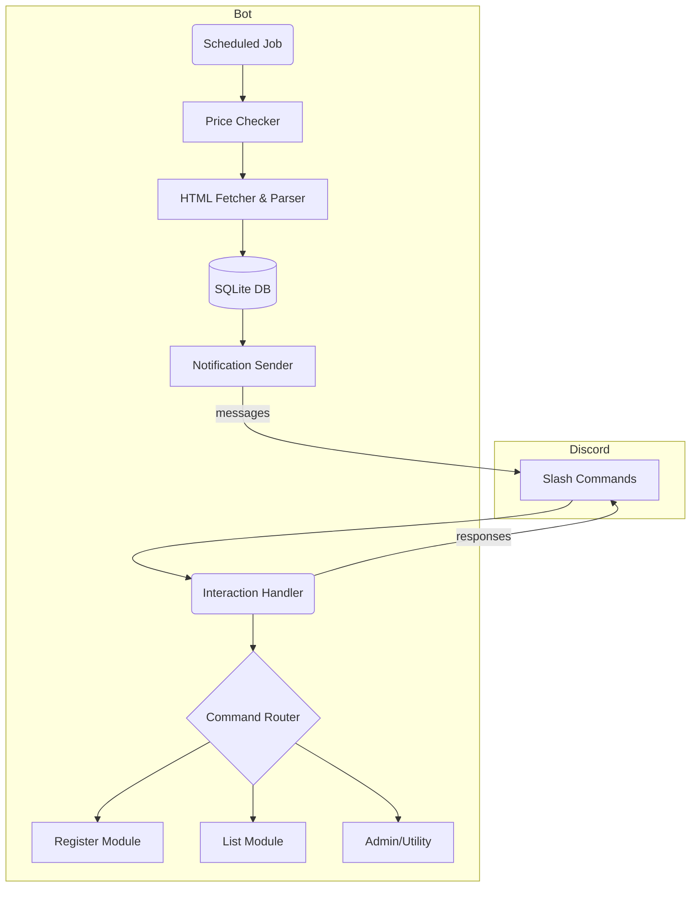

# セール通知 Discord ボット仕様書 (SPEC)

## 概要

本ボットは、ユーザーがチャットに送信した商品リンクを登録し、登録時点の価格を基準として一定割合以上値下げされた際に Discord チャンネルへ通知するツールです。ユーザーはリンクと商品名を空白区切り（全角・半角を問わない）で投稿するだけで登録が可能です。基準価格の 90 % 未満に下がった際に通知することをデフォルトとし、ユーザーは商品ごとにしきい値を指定できます。商品登録の一覧表示や個別商品の詳細表示を行う `/list` コマンドも実装します。ボットは複数のオンラインショップに対応し、価格取得を定期的に行います。

## ゴールと非ゴール

- **ゴール**
  - 登録した商品の価格がしきい値より下がった場合に Discord へ通知する。
  - ユーザーが簡易な方法で商品を登録・確認できる UI を提供する。
  - サーバーに大きな負荷をかけない設計で運用できる。

- **非ゴール**
  - すべての通販サイトへの完全対応（各サイトごとに価格取得ロジックが異なり、段階的に対応する）。
  - ポイント還元やクーポン割引など、表示価格以外の値引き要素の反映。
  - 決済や購入支援などの機能。

## ユーザー体験 (UX) 要件

1. **商品登録**
   - ユーザーは Discord のチャットに「`<URL> <商品名>`」または「`<商品名> <URL>`」の形式で投稿するだけで商品の登録が完了します。空白区切りで順序は問わず全角/半角スペースを許容します。**同じ商品名に対して複数の URL を登録できる**ため、EC サイト別に価格差を追跡できます。
   - 登録時、各 URL ごとに初回取得時の価格を基準価格 (`base_price`) として保存します。しきい値はデフォルトで 90 %（価格が 10 % 以上下がった場合）とし、ユーザーが数値を指定した場合はその値を使用します。
   - 既に同名の商品が存在する場合は `products` テーブルを再利用し、URL 単位のエントリー (`product_urls` テーブル) を追加します。登録後、ボットは確認メッセージを送信し、登録内容としきい値を明示します。

2. **価格通知**
   - 価格がしきい値以下になった場合に、商品名・現在価格・対象 URL を含むメッセージを Discord に送信します。
   - 同じ価格で複数回通知しないよう、最後に通知した価格を記録します。再度値下げが進行した場合のみ通知します。

3. **商品一覧表示**
   - `/list` で登録済みの商品名の一覧を返します。名前の昇順で表示し、各商品に登録された URL 数と、代表的な基準価格（最初に登録した URL の `base_price` など）を併記します。複数 URL が登録されている場合は範囲や平均値を表示することで、目安となる価格帯が把握できます。
   - `/list <商品名>` でその商品名に紐づく URL の一覧を返します。各 URL ごとに基準価格・現在価格・しきい値を表示し、存在しない場合はその旨を返信します。

4. **操作方法**
   - コマンドは **Slash Command** を採用します。Discord は公式ブログで、スラッシュコマンドが従来のプレフィックスコマンドに比べてアクセシビリティが高く、ユーザーが `/` を入力するだけで利用可能なコマンド一覧が表示されることを強調しています【451226144069221†L160-L190】。また、組み込みのバリデーションや型付き引数入力が提供されるため、ユーザー入力の検証が簡単になります【451226144069221†L226-L236】。さらに、discord.js ガイドではスラッシュコマンドが自動で引数解析や型検証、ポップアップ形式の入力を提供する利点を挙げています【85344728512784†L68-L79】。
   - プレフィックス型の手入力コマンドも互換性のために限定的に受け付けますが、Slash Command を推奨します。

## システム構成

### 技術スタック

| 層/モジュール          | 採用技術 | 理由 |
|----------------------|----------------|------|
| 言語・ランタイム        | **TypeScript + Bun 1.3 (必要に応じて Node.js 24 や Deno 2.6)** | サーバーサイドは静的型付きの TypeScript と高速な Bun を組み合わせます。Bun は JavaScriptCore エンジン上で動作し、HTTP スループット 110 k req/s、8–15 ms のコールドスタート、`bun install` 1 秒という圧倒的な性能を持ち、同梱のパッケージマネージャ・バンドラ・テストランナーにより開発が簡素化します【890783236906889†L310-L320】【890783236906889†L344-L353】。内蔵の `bun:sqlite` モジュールは 10,000 行を 12 ms で挿入でき、Node.js より高速です【890783236906889†L327-L330】。デフォルトランタイムとして Bun を採用し、互換性や既存ライブラリが必要な場合は Node.js 24 を、厳格な権限モデルが必要なユースケースには Deno 2.x を検討します。【890783236906889†L250-L264】 |
| Discord Bot フレームワーク | **discord.js v14** | Discord.js ガイドが提供するスラッシュコマンドの作成・登録方法が充実しており【85344728512784†L68-L139】、コミュニティ規模が大きくメンテナンスされている。 |
| データベース            | **SQLite** | SQLite はクライアント/サーバー型 DBMS ではなくアプリ内で完結し、インストールが容易で単一ファイルとして保存できるため軽量なアプリに最適です【139909074021870†L33-L41】。低〜中程度のトラフィックの Web サイトに十分対応でき、1 日 10 万ヒット程度まで問題なく動作すると公式サイトで説明されています【139909074021870†L78-L85】。 |
| HTTP クライアント      | **node-fetch** または **axios** | シンプルな API を備え、Promise ベースで非同期処理に対応。 |
| HTML パーサ           | **Cheerio** | Cheerio は HTML/DOM 解析ライブラリであり、jQuery に似た API でサーバーサイドの HTML 解析が容易なうえ、柔軟で高速に動作することを公式サイトが強調しています【624435420874740†L34-L52】。|
| スケジューラ           | **node-cron** | Node-cron は 7 年以上維持されている安定したスケジューラで、GNU crontab 形式の表現を使ってジョブの実行タイミングを設定できます【359643365890128†L285-L304】。`schedule` メソッドで特定時間や間隔ごとにジョブを実行でき、ジョブの開始・停止・破棄も可能です【359643365890128†L285-L304】。単純な定期実行が用途であるため、軽量で依存関係の少ない node-cron が適しています。 |
| ストレージ層ライブラリ | **bun:sqlite** / **better-sqlite3** / **knex** | Bun にはネイティブの `bun:sqlite` モジュールが内蔵されており、10,000 行の挿入をわずか 12 ms で実行できる高速なバインディングを提供します【890783236906889†L327-L330】。Bun 環境であれば追加のラッパーは不要ですが、Node.js 実行時には `better-sqlite3`（メモリ効率の良い同期 API）やクエリビルダーの knex を利用します。 |
| テストフレームワーク | **Vitest**（将来的に Bun の test runner も検討） | テストランナーには Vitest を採用します。Vitest はゼロコンフィグで TypeScript を扱え、ESM モジュールをネイティブにサポートし、Jest に比べて 5〜28 倍高速な実行速度と 57 % 低いメモリ消費を実現します【514055409548994†L595-L607】。一方、Jest は豊富なエコシステムと React Native への対応を持ちますが、実行速度が遅く設定が複雑です【514055409548994†L622-L643】。本プロジェクトは新規の TypeScript ベースであり、Vite（将来導入予定）との統合や高速な CI を重視するため Vitest を選択します。 |
| デプロイメント         | 任意（VPS、クラウドワーカーなど） | ボットは単一ファイル DB と Bun プロセスのみで動作するため、VPS や Cloudflare Workers、Docker コンテナなど柔軟に配置可能。Bun は単一バイナリとして配布されるためコンテナサイズを小さく保てます。 |

### 環境構築 (Nix)

本プロジェクトでは、開発環境と CI/CD の再現性を高めるために [Nix](https://nixos.org/) を利用します。Nix を用いることで、Bun、SQLite、テストランナーなどの依存関係を 1 つの宣言ファイルに記述し、どのマシンでも同一の環境を構築できます。

以下は `shell.nix` の一例です。開発者は `nix-shell` または `nix develop` コマンドで環境を起動し、`bun` コマンドや SQLite CLI が利用可能になります。

```nix
{ pkgs ? import <nixpkgs> {} }:
pkgs.mkShell {
  buildInputs = with pkgs; [
    bun        # Bun ランタイムとそのツールチェーン
    sqlite     # SQLite CLI
    nodejs     # Node.js (一部の Node API 用にオプション)
    # 必要に応じて pkg-config や python3 などのネイティブビルド依存を追加
  ];
  # Bun を初回起動時にインストールするための hook
  shellHook = ''
    export BUN_INSTALL="$HOME/.bun"
    export PATH="$BUN_INSTALL/bin:$PATH"
  '';
}
```

この定義では `bun` パッケージによってランタイムおよびパッケージマネージャが提供され、`sqlite` によって CLI が利用できます。さらに、Bun に内蔵されている `bun:sqlite` バインディングを利用する場合は追加のネイティブ依存を指定する必要はありません。Nix を利用することで開発者間の環境差異を解消し、CI でも同一のビルド環境を再現できます。

<!-- Python による代替案は採用しないため削除しました -->

### システムアーキテクチャ

本仕様書はエンジニア向けにアーキテクチャの全体像を共有するため、テキストベースの図よりもコードとして記述できる mermaid を採用します。以下は本ボットの概要フローを示す mermaid ダイアグラムです。



1. **Interaction Handler**: Discord から受信したスラッシュコマンドやメッセージイベントを取得し、コマンドルーターに渡します。Discord.js の `Interaction` API を利用してレスポンスを返します。
2. **Command Router**: コマンド名に応じて登録処理、リスト表示処理など適切なモジュールを呼び出します。各モジュールは非同期関数として実装します。
3. **Scheduled Job (Price Checker)**: node-cron により一定間隔（例：10 分毎）で実行され、登録された URL エントリーの価格を取得します。取得処理中は過剰なリクエストを避けるために `Promise.allSettled` やキュー制御を用います。価格取得の失敗はログに記録し、次回実行時に再試行します。
4. **HTML Fetcher & Parser**: HTTP クライアントで商品ページの HTML を取得し、Cheerio で DOM 解析を行って価格を抽出します。サイトごとにパーサー関数を分け、セレクタの更新に備えて独立モジュールにします。Cheerio は高速で柔軟な HTML パーサとして広く利用されています【624435420874740†L34-L52】。
5. **SQLite DB**: `products`、`product_urls`、`price_history` テーブルで商品情報と価格履歴を保存します。SQLite はシンプルで軽量なため小規模アプリに適しており、単一ファイルのデータベースをアプリ内に持つことで複雑なサーバー管理を不要にします【139909074021870†L33-L41】【139909074021870†L78-L85】。
6. **Notification Sender**: 価格がしきい値を下回った場合に通知メッセージを生成し、Discord の Webhook または `interaction.followUp()` を用いて送信します。メッセージには商品名・URL・現在価格・割引率を含めます。

## データモデル

### products テーブル

商品名を一意に管理するテーブルです。単一の商品名に複数の URL を関連付けるため、URL や価格情報は別テーブルに分離します。

| 列名 | 型 | 説明 |
|------|----|------|
| id | INTEGER PRIMARY KEY AUTOINCREMENT | 商品 ID |
| name | TEXT NOT NULL UNIQUE | 商品名。重複登録を防ぐためユニーク制約を設けます |
| created_at | TEXT DEFAULT CURRENT_TIMESTAMP | 登録日時 |

### product_urls テーブル

商品ごとの URL と価格設定を保持するテーブルです。1 つの商品名に複数の行が紐づきます。

| 列名 | 型 | 説明 |
|------|----|------|
| id | INTEGER PRIMARY KEY AUTOINCREMENT | URL エントリー ID |
| product_id | INTEGER NOT NULL | products.id への外部キー |
| url | TEXT NOT NULL | 商品ページの URL |
| base_price | INTEGER NOT NULL | 登録時の基準価格 (単位：円) |
| threshold_percent | REAL DEFAULT 10 | 通知発火の割引率 (%)。デフォルトは 10 (%割引) |
| last_price | INTEGER | 前回チェック時の価格 |
| last_notified_price | INTEGER | 最後に通知した価格。同じ価格での重複通知を防ぐため |
| enabled | INTEGER DEFAULT 1 | 監視対象かどうかを示すフラグ |
| created_at | TEXT DEFAULT CURRENT_TIMESTAMP | 登録日時 |

### price_history テーブル

価格履歴を記録するテーブルです。URL 単位で価格変動を保存します。

| 列名 | 型 | 説明 |
|------|----|------|
| id | INTEGER PRIMARY KEY AUTOINCREMENT |
| url_id | INTEGER NOT NULL | product_urls.id への外部キー |
| price | INTEGER NOT NULL | 取得した価格 |
| checked_at | TEXT DEFAULT CURRENT_TIMESTAMP | 価格取得日時 |

必要に応じて `servers` テーブル（ギルド ID と設定を保持）や `users` テーブル（登録ユーザー）を追加できます。

<!-- 重複定義を削除しました -->

## ワークフローと擬似コード

### 商品登録

1. ユーザーが「`/register <URL> <商品名> [--threshold <%>]`」コマンドを実行。
2. Interaction Handler が URL と商品名を抽出し、まず `products` テーブルに同名のレコードが存在するかを確認します。存在しなければ新規に挿入します。
3. URL から初期価格を取得し、`product_urls` テーブルに `product_id`、`url`、`base_price`、`threshold_percent`、`last_price` を保存します。同じ URL が既に登録されていれば更新し、しきい値の変更や base_price の再設定が行えます。価格取得に失敗した場合は登録を保留しエラーメッセージを返します。
4. 登録完了メッセージを返信する。

```ts
// TypeScript ベースの擬似コード
const registerCommand = async (interaction: ChatInputCommandInteraction) => {
  const url = interaction.options.getString('url', true);
  const name = interaction.options.getString('name', true);
  const threshold = interaction.options.getNumber('threshold') ?? 10;
  const price = await fetchPrice(url);
  if (!price) return interaction.reply({ content: '価格を取得できませんでした', ephemeral: true });
  // products テーブルに名前を挿入（既にあれば取得）
  const existingProduct = db.prepare('SELECT id FROM products WHERE name = ?').get(name);
  let productId: number;
  if (existingProduct) {
    productId = existingProduct.id;
  } else {
    const info = db.prepare('INSERT INTO products (name) VALUES (?)').run(name);
    productId = info.lastInsertRowid as number;
  }
  // URL ごとにエントリーを挿入または更新
  const existingUrl = db.prepare('SELECT id FROM product_urls WHERE url = ? AND product_id = ?').get(url, productId);
  if (existingUrl) {
    // 更新時は threshold や base_price を再設定できる
    db.prepare('UPDATE product_urls SET base_price = ?, threshold_percent = ? WHERE id = ?')
      .run(price, threshold, existingUrl.id);
  } else {
    db.prepare('INSERT INTO product_urls (product_id, url, base_price, threshold_percent, last_price, last_notified_price) VALUES (?, ?, ?, ?, ?, NULL)')
      .run(productId, url, price, threshold, price);
  }
  await interaction.reply(`登録しました: ${name} (${price}円, しきい値:${threshold}% )`);
};
```

### 価格チェックジョブ

1. node-cron で設定された間隔で実行。
2. `product_urls` テーブルから `enabled = 1` の行をすべて取得します（各 URL が監視対象になります）。
3. 各エントリーについて `fetchPrice(url)` を実行し、価格を取得。
4. `(base_price - currentPrice)/base_price * 100` を計算し、`threshold_percent` 以上かつ `currentPrice != last_notified_price` であれば通知を送信します。通知には商品名 (`products.name`)、現在価格、URL、割引率を含めます。
5. `last_price` および必要なら `last_notified_price` を更新し、`price_history` テーブルに挿入します。複数の URL が同じ商品名に紐づいている場合でも URL ごとに独立して判定します。

擬似コード:

```ts
const job = nodeCron.schedule('*/10 * * * *', async () => {
  // URL エントリー単位で監視する
  const entries = db.prepare('SELECT pu.*, p.name FROM product_urls pu JOIN products p ON pu.product_id = p.id WHERE pu.enabled = 1').all();
  for (const entry of entries) {
    const price = await fetchPrice(entry.url);
    if (!price) continue;
    const discount = ((entry.base_price - price) / entry.base_price) * 100;
    if (discount >= entry.threshold_percent && entry.last_notified_price !== price) {
      await sendNotification({ name: entry.name, url: entry.url }, price, discount);
      db.prepare('UPDATE product_urls SET last_notified_price = ?, last_price = ? WHERE id = ?')
        .run(price, price, entry.id);
    } else {
      db.prepare('UPDATE product_urls SET last_price = ? WHERE id = ?').run(price, entry.id);
    }
    db.prepare('INSERT INTO price_history (url_id, price) VALUES (?, ?)').run(entry.id, price);
  }
});
```

## コマンド仕様

| コマンド | 説明 | パラメータ |
|---------|------|-----------|
| `/register` | 商品の登録。URL・商品名・しきい値を受け付け、同じ商品名に複数の URL を紐付けられます。| `url` (必須): 監視する商品の URL / `name` (必須): 商品名 / `threshold` (任意): 割引率 (%) |
| `/list` | 登録済み商品の一覧を返します。各行に商品名・登録 URL 数・代表的な基準価格を表示します。| なし |
| `/list <name>` | 指定した商品名に紐づく URL の一覧を返します。各 URL ごとに基準価格・現在価格・しきい値を表示します。| `name` (必須) |
| `/delete <name> <url>` | 指定した商品名に対する URL の登録を削除します。| `name` (必須), `url` (必須) |
| `/set-base <name> <url> <price>` | 指定した URL の基準価格を手動で設定し直します。| `price` (必須): 円単位 |
| `/set-threshold <name> <url> <percent>` | 指定した URL のしきい値 (%) を変更します。| `percent` (必須) |
| `/help` | 使用可能なコマンドの説明を返す。| なし |

各コマンドは Discord のアプリケーションコマンド API で登録し、エイリアスとして旧来のテキスト入力も受け付けられるようにします。

## 拡張と考慮事項

- **スケーラビリティ**: SQLite は単一プロセスによるアクセスに優れており、小規模～中規模ボットであれば十分ですが、多数のユーザーが頻繁に登録や更新を行う場合は PostgreSQL などの RDBMS への移行も検討します。
- **サイトごとのスクレイピング**: HTML 構造が変更される場合に備え、サイトごとにパーサを分離し、失敗した際にはメールやログで知らせる仕組みを用意します。
- **Rate Limit**: Discord API にはレートリミットがあり、過剰なリクエストは 429 エラーとなります。discord.js は合理的なレートリミット処理を備えています【21409665949914†L31-L39】。
- **通知の絞り込み**: 同じ商品が複数ユーザーによって登録される場合、チャットのスパム防止として集約通知や DM 送信などのオプションも検討します。
- **セキュリティ**: Webhook URL や Bot Token は環境変数で管理し、ソースコードにハードコードしません。GitHub などに公開しないよう注意します。
- **多言語対応**: コマンド説明や通知メッセージを日本語・英語など多言語で提供する場合、i18n モジュールを使用します。
 - **ランタイムの選択肢**: 本仕様では Bun 1.3 をデフォルトランタイムとして採用します。Bun は HTTP スループットが約 110 k req/s、コールドスタートが 8–15 ms と高速で、パッケージインストールが 1 秒で完了するため CI/CD を大幅に短縮できます【890783236906889†L310-L320】。内蔵の SQLite ライブラリやバンドラ・テストランナーを利用することで開発体験も向上します【890783236906889†L344-L353】。ただし、npm 互換性 100 % と安定した LTS を重視する場合は Node.js 24 を、厳格な権限モデルやネイティブ TypeScript 実行が必要な場合は Deno 2.x を選択する余地もあります【890783236906889†L250-L264】。プロジェクトの要件に応じて適切なランタイムを選定してください。

## まとめ

このボットは、Discord のスラッシュコマンドを使ってユーザーが簡単に商品を登録し、基準価格から一定割合以上値下げされた際に通知することを目的としています。スラッシュコマンドはユーザーのアクセシビリティを高め、入力の検証を容易にするほか【451226144069221†L160-L190】【85344728512784†L68-L79】、開発者側でもバリデーションやエラー処理の負担を軽減します。バックエンドには Bun と discord.js (Node API 互換) を採用し、TypeScript で実装します。SQLite は軽量かつ簡易な永続化を提供し、Bun に同梱された `bun:sqlite` の高性能バインディングを利用できます【890783236906889†L327-L330】。価格取得には Cheerio を用いて効率的に HTML を解析し【624435420874740†L34-L52】、node-cron で定期的なジョブスケジューリングを行うことで、安定した動作と低い運用コストを実現します【359643365890128†L285-L304】。これらにより、ユーザーが求める「登録した商品が一定割合以上値下がりした時に通知が飛んでくる」体験をシンプルかつ確実に提供できます。

## 対応サイトと MVP 計画

### 対応サイトの選定

MVP では **ヨドバシカメラ** のみをサポート対象とします。追加調査や選定理由などの詳細は本仕様から省き、エンジニアが実装に必要な情報だけを記述します。将来的には Amazon.co.jp、楽天市場、Yahoo!ショッピングなどの主要サイトやフリマ系サイトへの対応も段階的に検討する予定です。

### MVP の機能範囲

最初のリリースでは機能を絞り、シンプルかつ確実に動作する MVP を目指します。以下の実装範囲と除外範囲を設定します。

- **サポートサイト**: MVP では **ヨドバシカメラ** のみを対象とします。ヨドバシはサイト構造が比較的シンプルで価格取得ロジックを実装しやすく、bot 対策も緩やかであるためです。Amazon や楽天など他サイトは bot 対策や認証が必要となるため拡張フェーズでの対応とします。
- **主要機能**:
  - **商品登録**: チャットにリンクと商品名を投稿して登録し、1 つの商品名に複数の URL を紐付けられるようにします。
  - **しきい値判定**: 登録時の 90 % を基準とし、登録者が任意に割引率を指定できるようにします。
  - **価格チェック**: cron ジョブで定期的に各 URL の価格を取得し、しきい値を下回った場合に Discord へ通知します。通知には商品名・現在価格・割引率・URL を含めます。
  - **一覧表示**: `/list` で商品名一覧と基準価格範囲を表示し、`/list <商品名>` で各 URL の詳細を表示します。
  - **データ永続化**: SQLite を利用して `products`、`product_urls`、`price_history` テーブルにデータを保存し、再起動しても情報が残るようにします。
- **除外機能**:
  - ポイント還元、送料、クーポン等の複雑な価格要素の計算。
  - Amazon 等の会員制 API 利用や認証が必要なスクレイピング。
  - 中古品やオークションサイトへの対応。
- **拡張計画**: MVP リリース後、利用者の要望や運用状況を踏まえて対象サイトを段階的に追加します。第 2 フェーズでは楽天市場や Yahoo!ショッピングを対象とし、第 3 フェーズでは Amazon への対応や C2C フリマ系サイト（メルカリ等）への拡張を検討します。API 利用や headless ブラウザ導入などは拡張フェーズで必要に応じて採用します。
